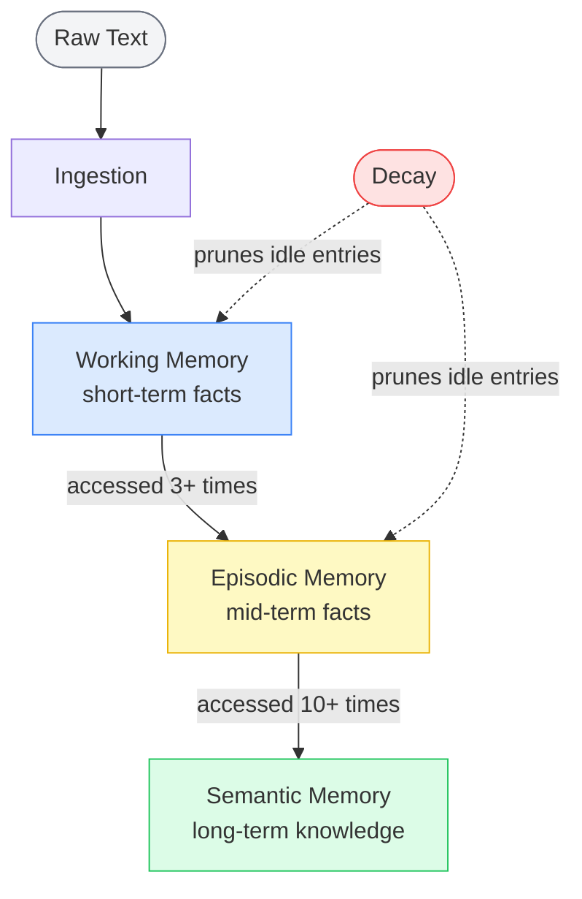
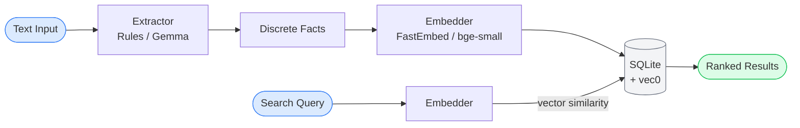
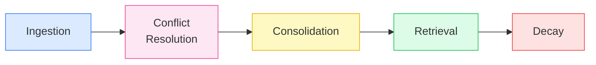

# mindlayer

[](https://pypi.org/project/mindlayer/)
[](https://github.com/Genious07/mindlayer/actions/workflows/ci.yml)
[](LICENSE)
[](https://pypi.org/project/mindlayer/)

Open-source, model-agnostic memory layer for LLMs.

Give any LLM application persistent, structured memory with a single `pip install`. No API key required. No infrastructure. No vendor lock-in.

```python
import mindlayer

with mindlayer.MemCore() as mem:
    mem.add("My name is Alice. I prefer dark mode and I work in Python.")
    results = mem.search("programming preferences")
    for r in results:
        print(r.content)
```

---

## Why mindlayer?

Most LLM apps lose context between sessions. Vector databases are heavy to set up. Existing memory libraries tie you to a specific LLM or cloud service.

mindlayer is different:

| | mindlayer |
|---|---|
| Setup | `pip install mindlayer`, nothing else |
| Storage | SQLite, embedded, zero config |
| LLM | Bring your own, or use built-in Gemma |
| Offline | Fully offline capable |
| License | MIT |

---

## Installation

```bash
pip install mindlayer
```

With semantic vector search (downloads ~130MB embedding model on first use):

```bash
pip install "mindlayer[vector]"
```

With LLM-powered extraction (downloads Gemma ~800MB on first use):

```bash
pip install "mindlayer[llm]"
```

---

## Architecture

### 3-Layer Memory Model

Inspired by how human memory works: short-term facts get promoted to long-term knowledge based on how often they are accessed.



### Data Flow



### 5 Core Primitives



---

## Usage

### Default: rule-based extractor, no LLM needed

```python
import mindlayer

mem = mindlayer.MemCore()
mem.add("I am a Python developer. I love open source.")
results = mem.search("developer")
```

### Semantic vector search: best recall

```python
# pip install "mindlayer[vector]"
mem = mindlayer.MemCore(use_vector=True)
mem.add("I prefer concise explanations and dislike verbose output.")
results = mem.search("communication style")
```

### Gemma LLM extractor: best extraction quality

```python
# pip install "mindlayer[llm]"
mem = mindlayer.MemCore(use_llm=True)
mem.add("Long conversation text with lots of context...")
```

### Bring your own extractor

```python
from mindlayer.extractors.base import BaseExtractor

class MyExtractor(BaseExtractor):
    def extract(self, text: str) -> list[str]:
        # call OpenAI, Anthropic, Ollama, anything
        return ["fact 1", "fact 2"]

mem = mindlayer.MemCore(extractor=MyExtractor())
```

### Bring your own storage backend

```python
from mindlayer.storage.base import BaseStorage

class PostgresStorage(BaseStorage):
    # implement the interface
    ...

mem = mindlayer.MemCore(storage=PostgresStorage())
```

### Memory maintenance

```python
mem.consolidate()  # promote memories across layers
mem.decay()        # decay and prune stale memories
```

---

## Roadmap

- [x] SQLite storage with vector search (sqlite-vec)
- [x] Rule-based extractor
- [x] Gemma LLM extractor (auto-download)
- [x] 3-layer memory model
- [ ] Async support
- [ ] PostgreSQL storage backend
- [ ] LLM-based conflict resolution
- [ ] REST API server mode
- [ ] JavaScript / TypeScript port

---

## Contributing

Contributions are welcome. Please open an issue before submitting large PRs.

```bash
git clone https://github.com/Genious07/mindlayer
cd mindlayer
pip install -e ".[dev,vector]"
pytest
```

---

## License

MIT
